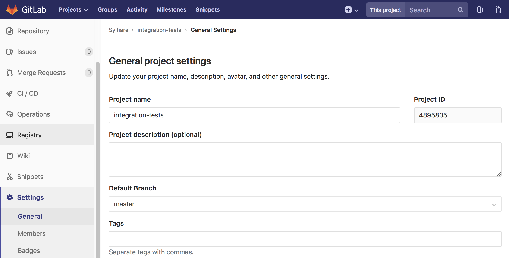

## Gitlab-stats

 

Get to the gitlab API and generates a report based on the pipeline builds.
Creates a report for the pipelines of the last two weeks. 
(On the assumption that there are less than 100 push per 2 weeks)

### Installation

Install via pip using:

```bash
pip install gitlab_stats
```

Local install with pip3:
```bash
pip3 install -e .   
```

In order to make it work:

- Create a `GITLAB_TOKEN` env variable with your access token.

### Get the project ID

For the script to work, you will need to get the project ID of your gitlab project.
It is a unique ID that is used by the gitlab REST API to store your project information.

Get it in `[your project] > Settings > General > General project settings`



### How to use

When installed you should be able to run it like that:

```bash
gitlab_stats <id> -u <your gitlab url> -p <your proxy>
```

Here is the help when `gitlab_stats -h`:

```bash
usage: gitlab_stats [-h] [-r] [-u URL] [-p PROXY] id

gitlab_stats: Generate a report from gitlab's pipeline metrics

positional arguments:
  id                    Put the id of the gitlab project

optional arguments:
  -h, --help                show this help message and exit
  -r, --report              Generate a csv report
  -u URL, --url URL         Put the url of your gitlab instance if different from
                            https://gitlab.com
  -p PROXY, --proxy PROXY   Add the url of your proxy like
                            'http://my.proxy.url:8083'
```


